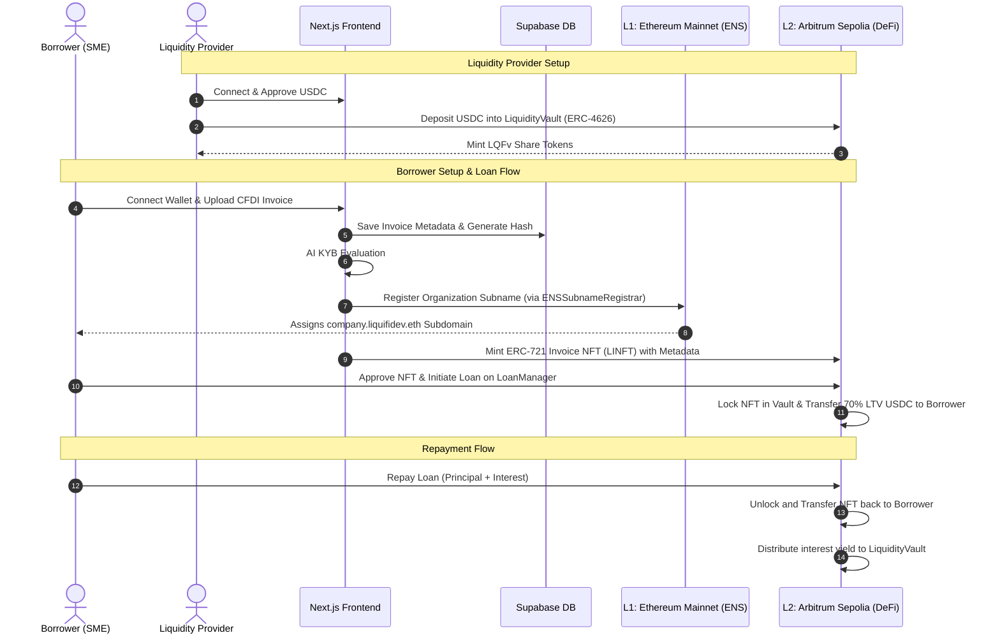

# LiquiFi - Decentralized Invoice Financing Protocol

🏆 **1st Place Winner** in the **Arbitrum Innovation Track** at **Ethereum Mexico 2025**

LiquiFi is a next-generation decentralized invoice financing (factoring) platform designed to unlock frozen working capital for small and medium-sized enterprises (SMEs) in Latin America. By combining Web3 identity and DeFi primitives, LiquiFi offers immediate liquidity at a fraction of the cost of traditional financial institutions.

🌐 **Live Demo:** [liquifidev.vercel.app](https://liquifidev.vercel.app)

---

## 📖 Table of Contents

- [Overview](#-overview)
- [How it Works](#-how-it-works)
- [System Architecture](#-system-architecture)
- [Smart Contracts](#-smart-contracts)
- [Tech Stack](#-tech-stack)
- [Prerequisites](#-prerequisites)
- [Local Setup & Configuration](#-local-setup--configuration)
- [Deployment Guide](#-deployment-guide)
- [Available Scripts](#-available-scripts)
- [Security Features](#-security-features)
- [License](#-license)

---

## 🎯 Overview

In Latin America, SMEs face severe cash flow constraints. Invoices (specifically Mexican electronic invoices, **CFDI**) often take 30, 60, or 90 days to clear. Traditional factoring (invoice discounting) is slow, paper-heavy, and charges exorbitant interest rates (up to 30-50% APR).

**LiquiFi** redefines this flow using Web3 technology:
- **70% LTV Liquidity**: Borrowers mint their XML/PDF invoice metadata as a verified ERC-721 NFT (LINFT) and instantly access up to 70% of its face value in USDC.
- **8-15% APY for Liquidity Providers**: Investors deposit USDC into an ERC-4626 vault that automatically routes capital to collateralized, yield-bearing SME loans.
- **ENS Identity & KYB**: Verified organizations receive custom Ethereum Mainnet L1 subnames (e.g., `company.liquifidev.eth`), binding off-chain corporate registry validity with on-chain credit history.
- **30-50% Cheaper**: Replaces middleman processing fees with automated smart contracts.

---

## 🏗️ How it Works

### For Borrowers (SMEs)
1. **Connect Wallet**: Authenticate using a Web3 wallet (on Arbitrum Sepolia).
2. **Upload CFDI Invoice**: Upload your official Mexican XML/PDF invoice.
3. **Execute KYB & ENS Registration**:
   - The platform performs an automated corporate check (evaluating credit indicators).
   - Once approved, a subdomain registration request is sent to Mainnet L1 (e.g., `acme.liquifidev.eth`).
4. **Tokenize Invoice (Mint NFT)**: The invoice's details (debtor, amount, due date, hash) are minted into a non-fungible token (ERC-721).
5. **Request Loan**:
   - Lock the NFT into the `LoanManager` contract.
   - Instantly draw down up to 70% LTV in USDC from the liquidity pool.
6. **Repay & Reclaim**: Repay the loan principal + interest before the grace period expires to unlock and reclaim your invoice NFT.

### For Investors (LPs)
1. **Deposit USDC**: Deposit USDC stablecoins into the `LiquidityVault` (ERC-4626).
2. **Earn Yield**: Earn interest payments from active loans. The vault represents LP ownership through `LQFv` vault share tokens.
3. **Withdraw**: Redeem vault shares back to USDC at any time, subject to pool liquidity.

---

## 🌐 System Architecture

LiquiFi utilizes an optimized cross-chain design using Ethereum Mainnet (L1) for persistent identity and Arbitrum Sepolia (L2) for low-cost, high-throughput DeFi lending operations.



---

## 📁 Project Structure

```
liquifi/
├── app/                  # Next.js 16 App Router
│   ├── api/              # API routes (invoices, kyb, mint, borrow)
│   ├── borrow/           # Borrowing dashboard (Upload CFDI, Mint NFT, Request Loans)
│   ├── invest/           # Investing dashboard (ERC-4626 deposit/withdraw actions)
│   ├── page.tsx          # Marketing home page
│   └── layout.tsx        # Global layout & Providers (Wagmi, QueryClient)
├── components/           # Shared React UI Components
│   ├── ConnectWallet.tsx # Web3 wallet connection dropdown
│   ├── UploadCFDI.tsx    # File drag-and-drop & parsing helper
│   ├── MintInvoice.tsx   # NFT minting triggers
│   ├── VaultActions.tsx  # Deposit/Withdraw forms for the LP Vault
│   └── Navigation.tsx    # Header & navigation links
├── lib/                  # Utilities and Web3 config
│   ├── wagmi.ts          # Wagmi config (Arbitrum Sepolia & Mainnet)
│   ├── supabase.ts       # Supabase server client
│   └── contracts.ts      # ABI map & contract addresses
├── contracts/            # Smart Contracts Workspace (Hardhat)
│   ├── contracts/        # Solidity Smart Contracts
│   ├── scripts/          # Contract deployment & calculations
│   └── hardhat.config.ts # Hardhat compile & network setup
├── abi/                  # Generated contract ABIs for the frontend
├── supabase/             # Database Schemas & Migrations
└── docs/                 # Extended technical walkthroughs
```

---

## 📜 Smart Contracts

### L1 Ethereum Mainnet (Identity)
- [ENSSubnameRegistrar.sol](file:///Users/alejandro/repos/liquifi/contracts/contracts/ENSSubnameRegistrar.sol)
  - **Purpose**: Issues off-chain validated organizations a custom `name.liquifidev.eth` subdomain.
  - **Mechanics**: Implements subname wrapping. The parent node must be wrapped and owned by the registrar contract.

### L2 Arbitrum Sepolia (DeFi Core)
- [MockUSDC.sol](file:///Users/alejandro/repos/liquifi/contracts/contracts/MockUSDC.sol)
  - **Purpose**: Mock ERC-20 token mimicking USDC (6 decimals) for local testing and testnet interactions.
- [LiquiFiINFT.sol](file:///Users/alejandro/repos/liquifi/contracts/contracts/LiquiFiINFT.sol)
  - **Purpose**: ERC-721 representing tokenized invoices.
  - **Metadata**: Stores debtor address, invoice amount, due date, and IPFS metadata URI.
- [LiquidityVault.sol](file:///Users/alejandro/repos/liquifi/contracts/contracts/LiquidityVault.sol)
  - **Purpose**: ERC-4626 vault managing pool liquidity, accepting deposits, and minting vault shares (`LQFv`). It serves as the custodian for invoice NFTs locked as collateral.
- [LoanManager.sol](file:///Users/alejandro/repos/liquifi/contracts/contracts/LoanManager.sol)
  - **Purpose**: Oversees lending operations. It enforces the maximum 70% LTV parameter, calculates annual interest rates (10%), manages repayments, and coordinates default liquidations.

---

## 🛠️ Tech Stack

- **Frontend**: Next.js 16 (App Router), TypeScript, TailwindCSS, Lucide Icons
- **Web3 Integrations**: wagmi v2, viem v2, ethers.js v6
- **State Management & Data Fetching**: TanStack React Query v5
- **Database**: Supabase (PostgreSQL)
- **Smart Contract Environment**: Solidity 0.8.24, Hardhat, OpenZeppelin v5
- **Package Manager**: Bun (Standardized environment)

---

## 📋 Prerequisites

Ensure you have the following installed and configured before running the project:

- **Bun** (v1.x) installed locally (`curl -fsSL https://bun.sh/install | bash`)
- **MetaMask** or any EIP-1193 compatible Web3 wallet
- **Alchemy** Account (API keys for Arbitrum Sepolia and Ethereum Mainnet)
- **Supabase** Project (PostgreSQL instance with SQL tables initialized)
- Testnet funds (ETH on Arbitrum Sepolia and Sepolia/Mainnet for identity tasks)

---

## ⚙️ Local Setup & Configuration

### 1. Clone & Install
```bash
# Clone the repository
git clone <repository-url>
cd liquifi

# Install frontend and root dependencies
bun install

# Install smart contract dependencies
cd contracts
bun install
cd ..
```

### 2. Environment Variables

#### Root `.env.local`
Create a `.env.local` file in the root directory. Refer to `.env.local.example` for details:
```bash
# Alchemy API Keys
NEXT_PUBLIC_ALCHEMY_API_KEY=your-arb-sepolia-key
NEXT_PUBLIC_ALCHEMY_POLICY_ID=your-arb-sepolia-policy-id

# Supabase Configurations
NEXT_PUBLIC_SUPABASE_URL=https://your-project.supabase.co
NEXT_PUBLIC_SUPABASE_PUBLISHABLE_KEY=your-publishable-key
SUPABASE_SERVICE_ROLE_KEY=your-service-role-key

# Deployed L2 Smart Contracts (Arbitrum Sepolia)
NEXT_PUBLIC_MOCK_USDC_ADDRESS=0x75faf114eafb1BDbe2F0316DF893fd58CE46AA4d
NEXT_PUBLIC_INFT_CONTRACT_ADDRESS=0x07d0D37cb4cb97ef60c0f881623025b1a2104Eb6
NEXT_PUBLIC_VAULT_CONTRACT_ADDRESS=0xF831fafDEc6DF2C21830052CDFD504AA759DD850
NEXT_PUBLIC_LOAN_MANAGER_ADDRESS=0xbF7C1287a064a81aa02612562236CdA6A7d614C3

# Deployed L1 ENS Registrar (Ethereum Mainnet)
NEXT_PUBLIC_ENS_REGISTRAR_MAINNET=0xa6EA99E4b6eEf5284823DB4A7ad2882480e4cd52
ENS_PARENT_NAME=liquifidev.eth
ENS_PARENT_NODE=0x... # Obtain via Namehash calculation script
ALCHEMY_MAINNET_API_KEY=your-mainnet-key

# Server-side Deployer Account
DEPLOYER_PRIVATE_KEY=0x...
```

#### Contracts `.env`
Create a `.env` file in the `contracts/` directory. Use `contracts/.env.example` as a template:
```bash
# L1/L2 Alchemy Nodes
ALCHEMY_API_KEY=your-arb-sepolia-key
ALCHEMY_POLICY_ID=your-arb-sepolia-policy-id
ALCHEMY_MAINNET_API_KEY=your-mainnet-key

# Deployer Key
DEPLOYER_PRIVATE_KEY=0x...

# L1 ENS Parent Configurations
ENS_PARENT_NAME=liquifidev.eth
ENS_PARENT_NODE=0x...
```

---

## 🚀 Deployment Guide

### Database Setup
1. Open your **Supabase Dashboard** and navigate to the **SQL Editor**.
2. Run the SQL schema script provided in [supabase/migrations/](file:///Users/alejandro/repos/liquifi/supabase/migrations/) or refer to the tables configuration in the setup manual. This sets up:
   - `invoices`: Tracks invoice statuses, hashes, and matching NFT Token IDs.
   - `kyb_results`: Stores organizational credit scores and registered ENS statuses.
   - `loans`: Logs active and settled loans.
   - `ens_registrations`: Resolves domains to wallets and tracks transaction receipts.

### Smart Contracts Deployment

#### 1. Compile Contracts
Compile Solidity source files and generate TypeChain typings:
```bash
cd contracts
bunx hardhat compile
```

#### 2. Deploy to L2 (Arbitrum Sepolia)
```bash
bun run deploy:arb
```
This script:
1. Deploys `MockUSDC`, `LiquiFiINFT`, `LiquidityVault`, and `LoanManager`.
2. Pairs the `LoanManager` address in the Vault.
3. Mints initial `mUSDC` test liquidity and deposits it to seed the Vault.

#### 3. Deploy L1 Identity Contract (Ethereum Mainnet/Sepolia)
Ensure your deployer wallet owns a wrapped ENS domain name (e.g., `liquifidev.eth`), then run:
```bash
# Calculate parent node namehash
bun run calculate-namehash liquifidev.eth

# Deploy ENSSubnameRegistrar
bun run deploy:mainnet
```

#### 4. Export ABIs
Update the frontend with compiled contract interfaces:
```bash
# From the project root directory
bun run copy-abis
```

---

## 💻 Available Scripts

Run the following scripts from the project root using Bun:

### Frontend
- `bun run dev`: Starts the Next.js development server on [http://localhost:3000](http://localhost:3000).
- `bun run build`: Creates an optimized production build of the Next.js frontend.
- `bun run lint`: Lints codebase files with relaxed rules for production checkouts.

### Helper & Validation Scripts
- `bun run copy-abis`: Copies compiled Hardhat artifacts to the frontend `/abi` directory.
- `bun run generate-wallet`: Generates a fresh random Ethereum wallet address and private key.
- `bun run verify-tx <tx_hash>`: Inspects details, events, gas, and returns explorers links for a given transaction hash.
- `bun run test:supabase`: Confirms connectivity and write access to the configured Supabase client.
- `bun run test:alchemy`: Validates JSON-RPC connectivity with Alchemy L1 and L2 endpoints.

---

## 🔒 Security & Optimization Features

- **ReentrancyGuard**: Prevents reentrancy attacks across state-sensitive interactions (repayments, withdrawals).
- **Custom Solidity Errors**: Drastically optimizes gas efficiency during execution reverts compared to traditional revert strings.
- **Strict Input Sanitization**: Validates parameters (zero-addresses, limits, grace-periods) in all core contract interfaces.
- **Owner Controlled Minting**: Invoices are minted on L2 via server-side signatures verifying off-chain CFDI uploads and hashes, avoiding double-financing.

---

## 📄 License

This project is licensed under the [MIT License](LICENSE).

---

**LiquiFi** - Redefining invoice factoring through decentralized, real-world asset (RWA) financing. Built with ❤️ at Ethereum Mexico 2025.
